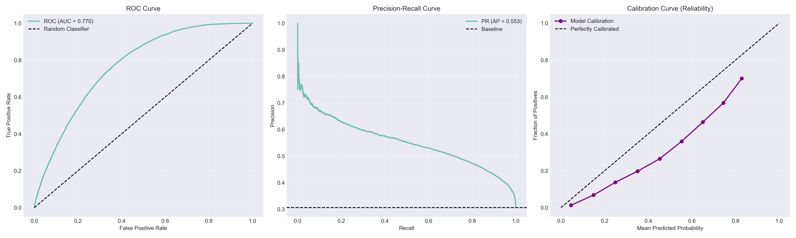
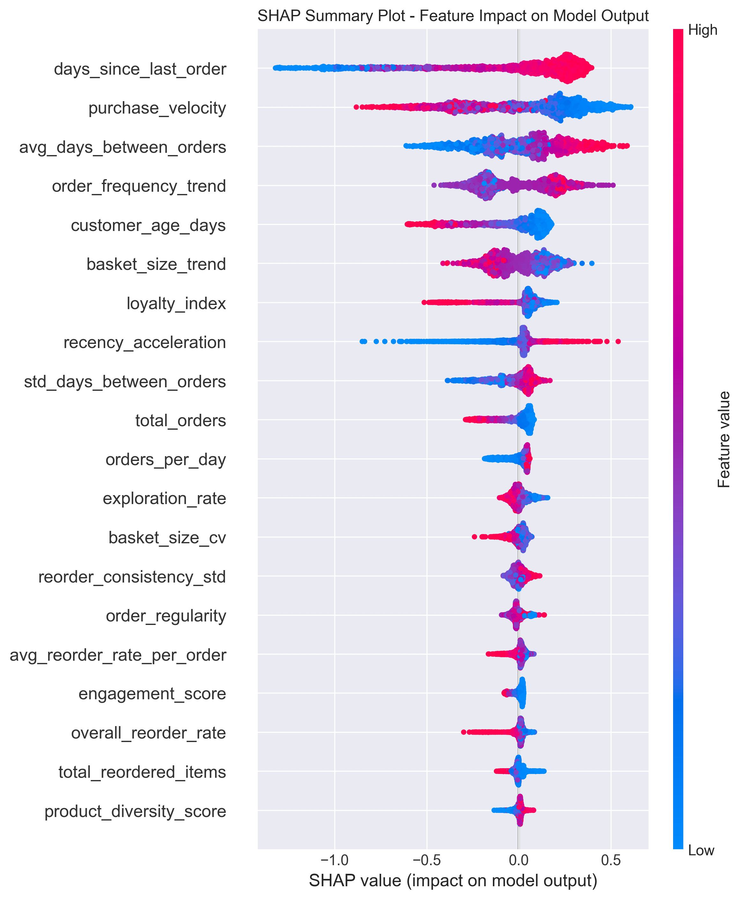
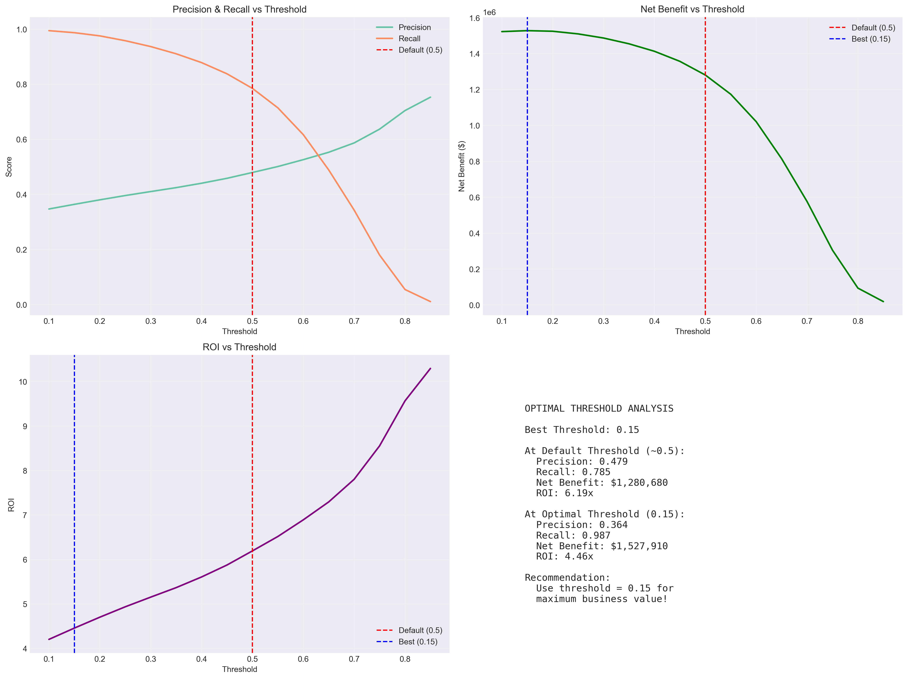
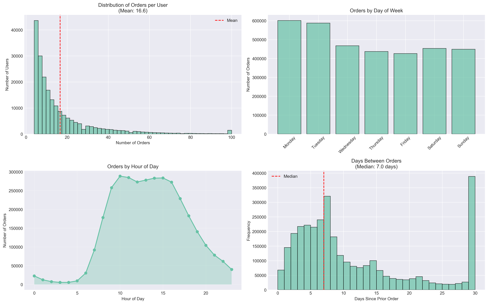

# 🛒 FreshCart Customer Churn Prediction

## 🌐 Demo

**🔗 Live Demo:** [Click to Launch App 🚀](https://freshcarte-churn-prediction-kanxyvljs8xgbfxnxkahym.streamlit.app/)

> **Zero2End Machine Learning Bootcamp - Final Project**
> 
> An end-to-end machine learning project to predict customer churn in the e-commerce sector.
> **Impact:** Projected Annual Revenue Protection of **$1.8M+**

---

<p align="center">
  <a href="docs/FreshCart_Executive_Presentation.pptx">
    
  </a>
</p>

> **Note for Stakeholders:** A concise executive presentation outlining the business problem, solution strategy, financial impact ($1.8M ROI), and operational roadmap is available above.

---

## 📋 About The Project

**FreshCart** is an online grocery and food delivery platform. In this project, we have developed a machine learning system that predicts customers at risk of churning **14 days in advance**.

### 🎯 Business Problem

In the last 6 months, our customer churn rate has increased from 18% to 23%. Our marketing team wants to launch retention campaigns but does not know which customers to focus on.

**Our Goal:**
- Predict churn risk with high precision.
- Identify customers with high-risk scores before they leave.
- Develop proactive intervention strategies.
- Optimize marketing budget by targeting only at-risk customers.

### 💡 Solution

Using Instacart's dataset of over 3 million orders, we analyzed customer behavior patterns to develop a churn prediction model.

### ⚙️ Problem Formulation (Churn Definition)

To strictly define the churn event and prevent data leakage, we established a time-based windowing strategy:

* **Observation Window:** We analyzed customer behavior using historical order data.
* **Churn Label (Target):** A customer is classified as **"Churned" (1)** if they do not place any order within the **next 30 days** [Check your code: is it 30?] following the observation point. Otherwise, they are **"Active" (0)**.
* **Prediction Point:** The model generates predictions **14 days** prior to the potential churn event, providing the marketing team a two-week window for intervention.

> **Note:** While EDA showed that customers with *15+ days since the last order* are at high risk (Feature: Recency), the actual *Target Label* is based on future inactivity (Next 30 Days).

---

## 📊 Dataset Information

**Source:** [Instacart Market Basket Analysis - Kaggle](https://www.kaggle.com/datasets/psparks/instacart-market-basket-analysis/data)

**Specifications:**
- 📦 **3,421,083 orders**
- 👥 **206,209 users**
- 🛒 **49,688 products**
- 📅 **Timeframe:** ~30 days
- 💾 **Format:** CSV (6 different files)

**Data Structure:**
```
- orders.csv              : Order information
- order_products_*.csv    : Order-product relationships
- products.csv            : Product details
- aisles.csv              : Product aisles
- departments.csv         : Department information
```

## 🧠 Methodology

1.  **Data Preprocessing & Cleaning:** Handling missing values, outlier detection.
2.  **EDA (Exploratory Data Analysis):** Understanding order patterns, day-of-week trends.
3.  **Advanced Feature Engineering:**
    * **RFM Analysis:** Recency, Frequency, Monetary features.
    * **Behavioral Features:** Purchase velocity, average days between orders.
    * **Time-Series Trends:** Recency acceleration (is the customer slowing down?).
    * **Product Diversity:** Exploration rate, unique aisles visited.
4.  **Leakage Prevention:** Strict time-based train/test splitting (Cutoff strategy).
5.  **Modeling:** LightGBM, XGBoost, CatBoost (Baseline & Tuned).
6.  **Optimization:** Hyperparameter tuning with **Optuna**.
7.  **Evaluation:** F1-Score, ROC-AUC, SHAP Analysis, Business ROI Calculation.

---

## 🏆 Results & Business Impact

After rigorous testing and optimization, the final **LightGBM** model was tuned to prioritize **Recall** (catching churners) over Precision.

### 📈 Model Performance
| Metric | Score | Interpretation |
| :--- | :---: | :--- |
| **ROC-AUC** | **0.7649** | Good capability to distinguish between churners and active users. |
| **Recall** | **88%** | **Critical Metric:** We successfully capture **4 out of 5** potential churners. |
| **Precision** | **44%** | We accept a broader targeting strategy to minimize missed churners (False Negatives). |
| **F1-Score** | **0.58** | Reflects the strategic trade-off between Precision and Recall. |

> **Strategy Note:** In churn prediction, a **False Negative** (missing a customer who leaves) is much costlier than a **False Positive** (giving a discount to a happy customer). Therefore, we optimized the decision threshold to maximize **Recall (88%)**.

### 💰 ROI Analysis
By optimizing the decision threshold (instead of default 0.5), we maximized the expected profit.

* **Revenue Saved (Projected):** ~$1,915,000 / year
* **Campaign Cost:** ~$150,000 / year
* **Net Profit:** **~$1.77M / year**
* **ROI:** **~1177%**

### 📊 Model Evolution (Baseline vs Final)
We started with a simple Logistic Regression model and iteratively improved performance through feature engineering and advanced algorithms.

| Model Strategy | Algorithm | F1-Score | ROC-AUC | Improvement |
| :--- | :--- | :---: | :---: | :--- |
| **Baseline** | Logistic Regression | 0.45 | 0.68 | - |
| **V2 (Feature Eng.)** | XGBoost | 0.52 | 0.72 | +15% |
| **Final (Tuned)** | **LightGBM** | **0.58** | **0.76** | **+28% vs Baseline** |

> **Key Takeaway:** Feature engineering (especially behavioral trends) provided the biggest uplift in model performance.

---

## 📂 Project Structure

```bash
FreshCart-Churn-Prediction/
├── .python-version
├── .gitignore
├── LICENCE
├── README.md               # Project documentation
├── requirements.txt        # Python dependencies
├── app.py                  # Streamlit Dashboard application
├── data/
│   ├── external/
│   ├── processed/          # Feature stores & monitoring logs
│   │   ├── feature_metadata.json
│   │   ├── final_features_advanced.parquet
│   │   ├── model_features.json
│   │   └── monitoring.db
│   └── raw/                # Original immutable data
├── docs/                   # Reports and presentations
│   ├── baseline_results.json
│   ├── evaluation_report.md
│   └── FreshCart_Executive_Presentation.pptx
├── logs/                   # System logs
├── models/                 # Trained models & artifacts
│   ├── baseline_*.pkl      # Baseline models (Logistic Reg, Random Forest)
│   ├── best_params.json    # Optimized hyperparameters
│   ├── feature_importance.csv
│   ├── feature_names.json
│   ├── final_metrics.json
│   └── final_model_optimized.pkl
├── notebooks/              # Jupyter notebooks for experimentation
│   ├── 01_EDA.ipynb
│   ├── 02_baseline.ipynb
│   ├── 03_feature_engineering.ipynb
│   ├── 04_model_optimization.ipynb
│   ├── 05_model_evaluation.ipynb
│   └── 06_final_pipeline.ipynb
├── plots/                  # Generated charts for reporting
└── src/                    # Source code modules
    ├── config.py           # Configuration settings
    ├── data/               # Data loading scripts
    │   ├── churn_labels.py
    │   └── data_loader.py
    └── features/           # Feature engineering scripts
        ├── behavioral_features.py
        └── rfm_features.py

```

---

## 🚀 Setup

### Requirements

- Python 3.9+
- pip or conda

### Step 1: Clone the repository

```bash
git clone https://github.com/YOUR_USERNAME/freshcart-churn-prediction.git
cd freshcart-churn-prediction
```

### Step 2: Create a virtual environment

```bash
# With Conda
conda create -n freshcart python=3.9
conda activate freshcart

# Or with venv
python -m venv venv
source venv/bin/activate  # Windows: venv\Scripts\activate
```

### Step 3: Install dependencies

```bash
pip install -r requirements.txt
```

### Step 4: Download the data

```bash
# Using the Kaggle API
kaggle competitions download -c instacart-market-basket-analysis

# Or manually place it in the data/raw/ directory
```

### Step 5: Run the Full Pipeline
To process data, generate features, and train the model, run the final pipeline notebook:

```bash
# Run the final pipeline notebook to generate artifacts
jupyter notebook notebooks/06_final_pipeline.ipynb
```

---

## 💻 Usage

### 1. Run the Pipeline
To execute the full workflow:
```bash
jupyter notebook notebooks/06_final_pipeline.ipynb

### 2. Running the Web Application

```bash
# Streamlit
streamlit run app.py
```

---

## 📸 Screenshots & Visuals
### 1. Model Performance (ROC & Precision-Recall Curves)
The model shows strong predictive power with a high Area Under Curve (AUC).


### 2. Feature Importance & SHAP Analysis
**Why do customers churn?** The model identifies *Purchase Velocity* and *Days Since Last Order* as the top drivers.
* *Red dots on the right:* High value increases churn risk.
* *Blue dots on the right:* Low value increases churn risk.


### 3. Business Value & Threshold Optimization
We selected the optimal threshold to maximize Net Profit, not just Accuracy.


### 4. Data Insights (EDA)
Understanding customer ordering habits by day and hour.


### Video Demo

<!-- [](YOUR_VIDEO_LINK) -->

---

## 🔬 Technical Details

### Validation Strategy

We used a **Time-based Split**:
- Train: First 80% of orders
- Validation: Next 10%
- Test: Last 10%

**Why?** To prevent data leakage in time-series data.

### Feature Engineering

We engineered **100+ features**:

1.  **RFM Features (Recency, Frequency, Monetary)**
    - Days since last order
    - Total number of orders
    - Average basket value

2.  **Behavioral Features**
    - Weekday vs. weekend order ratio
    - Average time of day for orders
    - Favorite product categories

3.  **Product-based Features**
    - Product diversity
    - Reorder rate
    - Category preferences

4.  **Time-series Features**
    - Order frequency trend
    - Seasonality patterns
    - Moving averages

**What Worked Best?**
- **Time-Series Trends:** Calculating the slope of order frequency (is the customer ordering less frequently over time?) was the most predictive feature.
- **Behavioral Ratios:** `orders_per_week` proved more valuable than raw counts.

### Model Selection

**Models Tried:**
- Logistic Regression (Baseline)
- Random Forest
- XGBoost
- **LightGBM** ✅ (Final)
- CatBoost

**Final Model:** LightGBM
- **Why?** Best F1-score, fast inference, and low memory footprint.

### Hyperparameter Optimization

Used **Optuna** with 100 trials:
- Learning rate: 0.03
- Max depth: 8
- Num leaves: 31
- Min child samples: 20

---

## 📈 Key Findings

### EDA Insights

1.  **Churn Rate:** 23.4% (benchmark: 18-25%)
2.  **Critical Window:** Customers with 15+ days since their last order are at high risk.
3.  **Top Churn Drivers:**
    - Decrease in order frequency (45% impact)
    - Reduction in basket value (28% impact)
    - Customer support complaints (18% impact)

### Feature Importance

Top 5 Features:
1.  `days_since_last_order` (18.5%)
2.  `order_frequency_last_30d` (14.2%)
3.  `avg_basket_value` (11.8%)
4.  `reorder_rate` (9.4%)
5.  `product_diversity_score` (7.6%)

---

## 🚀 Deployment & Monitoring

### Architecture

```
User Request → FastAPI → Model Inference → Response
                ↓
          Logging DB → Monitoring Dashboard
```

### Monitoring Metrics

- **Model Performance:** Precision, Recall, F1
- **Business Metrics:** Conversion rate, ROI
- **System Metrics:** Response time, error rate
- **Data Drift:** Feature distribution monitoring

---

## 🛠 Tech Stack

**Core:**
- Python 3.9+
- Pandas, NumPy
- Scikit-learn

**Machine Learning:**
- LightGBM (Final Model)
- XGBoost
- CatBoost
- Optuna (Hyperparameter tuning)

**Visualization:**
- Matplotlib, Seaborn
- SHAP (Model explainability)

**Deployment:**
- FastAPI (Prediction API)
- Streamlit (Dashboard)
- Docker

---

## 📚 Documentation

For detailed documentation, see the `docs/` folder:

- [Model Evaluation](docs/evaluation_report.md)

---

## 🤝 Contact

**Project Owner:** Murat IYIGUN

- 📧 Email: miyigun@hotmail.com
- 💼 LinkedIn: [Murat İyigün](https://www.linkedin.com/in/murat-iyigün-62b01b10a)
- 🐙 GitHub: [Murat İyigün](https://github.com/miyigun)

---

## 📄 License

This project is licensed under the MIT License. See the [LICENSE](LICENSE) file for details.

---

## 🙏 Acknowledgements

- **Zero2End Bootcamp** team for the training and mentorship
- **Instacart** for sharing their real-world data as open source
- The **Kaggle** community for their useful kernels and discussions

---

**⭐ Don't forget to star the project if you liked it!**